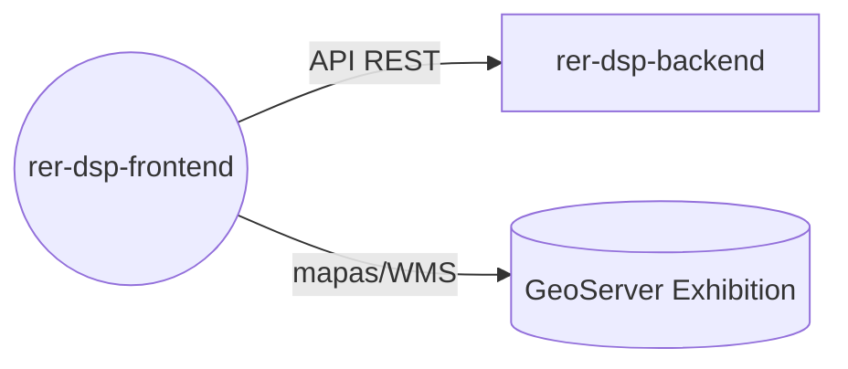

# rer-dsp-frontend

> Este repositório é um dos módulos do **DSP (Data Sharing Platform)**, parte do ecossistema RER.
> A documentação completa do projeto está em **[rer-dsp-docs](https://github.com/Rural-Environmental-Registry/rer-dsp-docs)**.
> As informações abaixo tratam apenas deste módulo, não do projeto DSP como um todo.

## Qual parte do DSP este módulo é



Downloads passam pela API do backend (que usa o GeoServer Download). O frontend de mapas fala só com o GeoServer Exhibition.
## Objetivo

Interface web para visualização e compartilhamento de dados ambientais rurais entre
instituições parceiras do RER.

## Responsabilidades

- Exibir dados ambientais e mapas (camadas WMS)
- Consumir a API REST do `rer-dsp-backend`
- Prover a experiência de usuário da plataforma DSP

## Tecnologias

Vue 3, Vite, TypeScript, Tailwind CS.

## Como executar

```bash
npm install
npm run dev
```

Ou, preferencialmente, via `rer-dsp-core` (`./start.sh`), que sobe toda a stack.

## Licença

[GNU General Public License v3.0](LICENSE)
